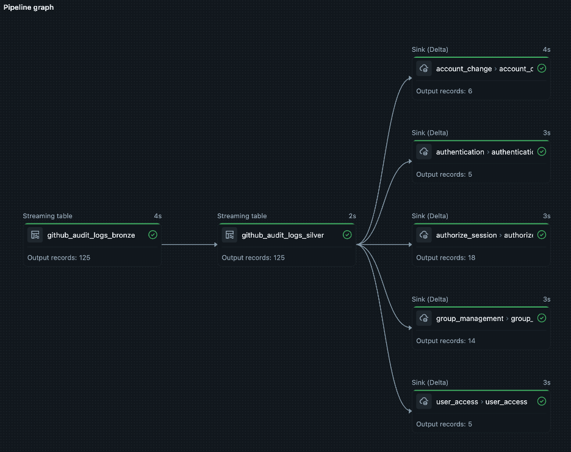

# DSL Lite - Lightweight Cybersecurity Data Pipeline Framework

> **🏗️ Databricks Cybersecurity Accelerator**
> Built by Databricks Forward Deployed Engineering

## Overview

**DSL Lite** is a reusable cybersecurity accelerator designed for building end-to-end cyber lakehouse architectures using an augmented medallion approach with [OCSF (Open Cybersecurity Schema Framework)](https://schema.ocsf.io/) compliance.

This lightweight, self-deployable framework uses configuration files called "presets" to transform security logs into bronze, silver, and gold layers with OCSF-compliant schemas. It's designed for customers building complex cybersecurity projects and use cases that require:
- **Scalable data ingestion** from multiple security log sources
- **Standardized schema transformation** to OCSF data models
- **Flexible deployment** in self-managed or restricted environments
- **Production-ready pipelines** with minimal configuration

### About This Accelerator

This accelerator was developed by **Databricks Forward Deployed Engineering** to enable customers to rapidly deploy enterprise-grade cybersecurity data pipelines. While Databricks owns the intellectual property, this accelerator is made publicly available to support the broader security community in building robust cyber lakehouse architectures on the Databricks platform.

**Builder, Architect, Author & Maintainer:** Garrett R Peternel | *FDE @ Databricks*

---

## 📑 Table of Contents

- [Overview](#overview)
- [Architecture](#architecture)
- [Project Structure](#project-structure)
- [OCSF Documentation](#ocsf-documentation)
- [Declarative Automation Bundles](#declarative-automation-bundles)
- [Getting Started](#how-to-use)
  - [Spark Declarative Pipeline (SDP)](#execute-as-spark-declarative-pipeline-sdp)
  - [Spark Structured Streaming (SSS)](#execute-as-spark-structured-streaming-sss-job)
- [Further Reading](#further-reading)
- [Development Workflow](#development-workflow)
- [Development & Testing Tools](#development--testing-tools)
- [Key Features](#key-features)
- [Supported Data Sources](#supported-data-sources)
- [Schema Maintenance](#schema-maintenance)
- [Limitations](#limitations)
- [License & Attribution](#license--attribution)

---

## Architecture

DSL Lite implements a three-layer medallion architecture — **Bronze** (ingest & amend), **Silver** (parse & curate), **Gold** (map & normalize to OCSF) — optimized for cybersecurity data pipelines. Input formats include JSON/JSON Lines, CSV, and Syslog.

> For full architecture details including the layer-by-layer schema table, data flow examples by format, OCSF metadata field mappings, schema version tracking, and performance guidelines, see [docs/dsl_lite_features/architecture.md](docs/dsl_lite_features/architecture.md).

### Example Pipeline Graph



*Figure: Example DSL Lite pipeline graph showing Auto Loader (bronze), silver transform, and multiple OCSF gold table sinks.*

### Example Pipeline Outputs

| Pipeline | Bronze (Ingest/Amend) | Silver (Parse/Structure) | Gold (Map/Normalize → OCSF) |
|----------|------------------------|--------------------------|----------------------------|
| **Cisco IOS** | `cisco_ios_bronze` | `cisco_ios_silver` | `authentication`, `authorize_session`, `network_activity`, `process_activity` |
| **Cloudflare Gateway DNS** | `cloudflare_gateway_dns_bronze` | `cloudflare_gateway_dns_silver` | `dns_activity` |
| **GitHub Audit Logs** | `github_audit_logs_bronze` | `github_audit_logs_silver` | `account_change`, `authentication`, `authorize_session`, `user_access`, `group_management`, `api_activity` |
| **Okta System Log** | `okta_system_log_bronze` | `okta_system_log_silver` | `authentication`, `account_change`, `group_management` |
| **Zeek Conn** | `zeek_conn_bronze` | `zeek_conn_silver` | `network_activity` |
| **AWS VPC Flow Logs** | `aws_vpc_flowlogs_bronze` | `aws_vpc_flowlogs_silver` | `network_activity` |

---

## Project Structure

```
dsl_lite/
├── src/                          # All Python source code
│   ├── dsl.py                   # Core DSL Lite logic
│   ├── utils.py                 # Utility functions
│   ├── sdp_medallion.py         # Entry point for SDP pipelines
│   ├── sss_bronze.py            # Bronze layer task (SSS mode)
│   ├── sss_silver.py            # Silver layer task (SSS mode)
│   ├── sss_gold.py              # Gold (OCSF) layer task (SSS mode)
│   └── sss_medallion.py         # Combined Bronze→Silver→Gold task (SSS mode)
├── notebooks/                    # Databricks notebooks
│   ├── ddl/
│   │   └── create_ocsf_tables.py    # OCSF gold table creation
│   ├── explorer/
│   │   ├── explorer_helpers.py      # Batch transform functions (loaded via %run)
│   │   └── preset_explorer.py       # Interactive preset development notebook
│   ├── agent/
│   │   ├── agent_helpers.py        # Agent helper functions (loaded via %run)
│   │   └── preset_agent.py         # Agent notebook to build presets via Databricks Foundation Model API
│   └── profiler/
│       ├── profiler_helpers.py      # Profiler helper functions (loaded via %run)
│       └── pipeline_profiler.py     # Schema diff, data profile, E2E sample run, OCSF coverage
├── .agents/                      # Augment AI agent skills
│   └── skills/
│       └── dsl-lite-preset-dev/  # Preset authoring skill (SKILL.md + references/)
├── bundles/                      # Declarative Automation Bundles — one per source/source_type (see bundles/README.md)
├── pipelines/                    # Configuration presets (Cisco, Zeek, Cloudflare, GitHub, AWS, etc.)
├── ocsf_templates/               # OCSF mapping templates (21 standardized templates)
├── docs/                         # Reference documentation
│   ├── dsl_lite_features/        # Pipeline & framework guides
│   │   ├── architecture.md       # Medallion architecture, data flow, OCSF metadata, performance
│   │   ├── advanced-configuration.md  # Skipping layers, per-table catalog/DB, fully qualified paths, checkpoint resets
│   │   └── lookup-joins.md       # Lookup join configuration and examples
│   ├── ocsf_spark_expressions/   # Gold-layer Spark SQL (CASE WHEN, named_struct)
│   ├── ocsf_event_categories/    # OCSF table docs by category (network, IAM, system)
│   └── ocsf_ddl_fields/          # DDL/reference for common structs (metadata, endpoint, ids, etc.)
├── tutorials/                    # Step-by-step guides
│   ├── building-a-preset-end-to-end.md
│   └── adding-a-bundle.md
├── images/                       # Screenshots and pipeline graph images for documentation
│   └── pipeline_graph.png        # Example pipeline graph (bronze → silver → gold)
├── DSL_Lite_Primer.html          # One-page customer/partner primer (print to PDF)
├── vault/                        # Maintenance utilities for template management
├── raw_logs/                     # Sample logs for testing (one per source/source_type)
├── .github/
│   └── CODEOWNERS                # Requires maintainer approval for all PRs to main
├── requirements.txt              # Python dependencies
├── Makefile                      # Dev shortcuts (validate-presets, etc.)
└── README.md                     # This file
```

---

## OCSF Documentation

| Folder | Contents |
|--------|----------|
| `docs/dsl_lite_features/architecture.md` | Medallion architecture, layer schemas, data flow examples, OCSF metadata mapping, performance guidelines. |
| `docs/dsl_lite_features/advanced-configuration.md` | Skipping layers, per-table catalog/database, fully qualified paths, checkpoint resets (SDP & SSS). |
| `docs/dsl_lite_features/lookup-joins.md` | Lookup join configuration, examples, and best practices. |
| `docs/ocsf_spark_expressions/` | Gold-layer Spark SQL: CASE WHEN templates, named_struct, bold-column field logic. |
| `docs/ocsf_event_categories/` | OCSF table docs by category: network_activity, identity_access_management, system_activity. |
| `docs/ocsf_ddl_fields/` | DDL and reference for common structs: metadata, endpoint, ids, cloud, connection_info, traffic, enrichments/observables, IAM (session, user, service). |

---

## Declarative Automation Bundles

The `bundles/` directory contains ready-to-deploy Declarative Automation Bundles — one per pipeline, isolated by `source/source_type`. Each bundle deploys independently to any Databricks workspace with no cross-pipeline dependencies.

| Bundle | SDP resource key | SSS resource key |
|---|---|---|
| `cisco/ios` | `cisco_ios_sdp` | `cisco_ios_sss` |
| `cloudflare/gateway_dns` | `cloudflare_gateway_dns_sdp` | `cloudflare_gateway_dns_sss` |
| `github/audit_logs` | `github_audit_logs_sdp` | `github_audit_logs_sss` |
| `okta/system_log` | `okta_system_log_sdp` | `okta_system_log_sss` |
| `zeek/conn` | `zeek_conn_sdp` | `zeek_conn_sss` |
| `aws/vpc_flowlogs` | `aws_vpc_flowlogs_sdp` | `aws_vpc_flowlogs_sss` |

```bash
cd bundles/cisco/ios
databricks bundle deploy -t dev
databricks bundle run cisco_ios_sdp -t dev
```

> For full setup instructions, variable reference, catalog routing, and a tutorial for adding new bundles see [bundles/README.md](bundles/README.md).

---

## How to Use

To deploy a new data streaming pipeline you need:

- **Databases**: Bronze, silver, and gold layers with OCSF-compliant tables (create using `notebooks/ddl/create_ocsf_tables.py`)
- **Preset configuration**: YAML files defining data transformations for your log source (located in `pipelines/` directory)
- **Input location(s)**: Configure data source paths in the preset's `autoloader.inputs` section (only required if not skipping bronze layer)

DSL Lite provides starter templates in the `ocsf_templates/` directory for common security log sources.

---

### Execute as Spark Declarative Pipeline (SDP)

> **Note**: Apache Spark™ includes **declarative pipelines** beginning in Spark 4.1 via the `pyspark.pipelines` module. Databricks Runtime extends these capabilities with additional APIs and integrations.

- Upload the `src` directory to your workspace.
- Create `source` and `source_type` folders (i.e. `cisco/ios`) under `pipelines` to your workspace.
- Create a Lakeflow Spark Declarative Pipeline and reference `src/sdp_medallion.py` as the entry point.
- Specify default catalogs and databases, plus the following required configurations:

  - `dsl_lite.config_file` (required) - should contain a full path to a configuration file that will be used to generate a pipeline.  Example: `/Workspace/Users/<user@email.com>/dsl_lite/pipelines/cisco/ios/preset.yaml`.
  - `dsl_lite.gold_catalog_name` (optional) - the name of UC catalog containing gold tables. Used as default if not specified per-table in YAML.
  - `dsl_lite.gold_database_name` (optional) - the name of UC database containing gold tables. Used as default if not specified per-table in YAML.
  - `dsl_lite.bronze_catalog_name` (optional) - the name of UC catalog containing bronze tables.
  - `dsl_lite.bronze_database_name` (optional) - the name of UC database containing bronze tables. Required if `dsl_lite.skip_bronze` is `false`. **Note:** Can be omitted if silver table YAML uses fully qualified `input: catalog.database.table` paths.
  - `dsl_lite.silver_catalog_name` (optional) - the name of UC catalog containing silver tables.
  - `dsl_lite.silver_database_name` (required) - the name of UC database containing silver tables. Always required for Gold layer processing. **Note:** Can be omitted if all gold tables use fully qualified `input: catalog.database.table` paths.
  - `dsl_lite.skip_bronze` (optional, default `false`) - Skip bronze ingestion and use existing bronze tables.
  - `dsl_lite.skip_silver` (optional, default `false`) - Skip silver transformation and use existing silver tables.

**Example configuration JSON (Full Pipeline):**
```json
{
  "configuration": {
    "dsl_lite.bronze_database_name": "bronze",
    "dsl_lite.silver_database_name": "silver",
    "dsl_lite.gold_database_name": "gold",
    "dsl_lite.config_file": "/Workspace/Users/user@email.com/dsl_lite/pipelines/cisco/ios/preset.yaml",
    "dsl_lite.gold_catalog_name": "dsl_lite"
  }
}
```

> For Gold Only / skipping layers examples, see [docs/dsl_lite_features/advanced-configuration.md](docs/dsl_lite_features/advanced-configuration.md).

---

### Execute as Spark Structured Streaming (SSS) Job

- Upload the `src` directory to your workspace.
- Create `source` and `source_type` folders (e.g. `cisco/ios`) under `pipelines` to your workspace.
- Choose one of three execution approaches:

**Option 1: Multi-Task Job (Recommended for Production)**
- Create a job with 3 separate tasks, each referencing the appropriate notebook:
  - **Task 1 (Bronze)**: `src/sss_bronze.py`
  - **Task 2 (Silver)**: `src/sss_silver.py` (depends on Bronze)
  - **Task 3 (Gold)**: `src/sss_gold.py` (depends on Silver)
- **Benefits**: Better separation of concerns, easier to debug individual layers, can skip layers by removing tasks

**Option 2: Single-Task Medallion Job (Recommended for Simplicity)**
- Create a job with a single notebook task that executes all three layers sequentially:
  - **Single Task**: `src/sss_medallion.py`
- **Benefits**: Simpler job configuration, all layers in one place, built-in skip options for Bronze/Silver
- **Use Cases**: Development, testing, or when you want to run the full pipeline in a single task

**Task Parameters by Layer:**

**Bronze Task (`src/sss_bronze.py`):**
  - `bronze_database` (required) - the name of database containing bronze tables - could be specified as `catalog.database`. Bronze does not support per-table catalog/database configuration.
  - `preset_file` (required) - full path to configuration file. Example: `/Workspace/Users/<user@email.com>/dsl_lite/pipelines/cisco/ios/preset.yaml`.
  - `checkpoints_location` (required) - path to storage location (DBFS or Volume) for checkpoints. Each input source gets its own checkpoint subdirectory: `{checkpoints_location}/bronze-{sanitized_input_name}`.
  - `continuous` (optional, default `False`) - run continuously (`True`) or batch mode (`False`).

**Silver Task (`src/sss_silver.py`):**
  - `bronze_database` (required) - the name of database containing bronze tables (same as Bronze task). Required to read from bronze tables. **Note:** Can be omitted if silver table YAML uses fully qualified `input: catalog.database.table` paths.
  - `silver_database` (required) - the name of database containing silver tables - could be specified as `catalog.database`. Silver does not support per-table catalog/database configuration.
  - `preset_file` (required) - full path to configuration file (same as Bronze task).
  - `checkpoints_location` (required) - path to storage location for checkpoints (can be same or different from Bronze). Each silver table gets its own checkpoint subdirectory: `{checkpoints_location}/silver-{sanitized_table_name}`.
  - `continuous` (optional, default `False`) - run continuously (`True`) or batch mode (`False`).

**Gold Task (`src/sss_gold.py`):**
  - `silver_database` (required) - the name of database containing silver tables (same as Silver task). Required to read from silver tables. **Note:** Can be omitted if all gold tables use fully qualified `input: catalog.database.table` paths.
  - `gold_database` (optional) - the name of database containing gold tables - could be specified as `catalog.database`. Used as default if not specified per-table in YAML. **Required only if any table omits `database` in YAML.**
  - `preset_file` (required) - full path to configuration file (same as Bronze/Silver tasks).
  - `checkpoints_location` (required) - path to storage location for checkpoints (can be same or different from other tasks). Each gold table gets its own checkpoint subdirectory: `{checkpoints_location}/gold-{table_name}`.
  - `continuous` (optional, default `False`) - run continuously (`True`) or batch mode (`False`).

**Medallion Task (`src/sss_medallion.py`) - All Layers Combined:**
  - `bronze_database` (required if `skip_bronze=False`) - the name of database containing bronze tables - could be specified as `catalog.database`. **Note:** Can be omitted if silver table YAML uses fully qualified `input: catalog.database.table` paths.
  - `silver_database` (required if `skip_silver=False`) - the name of database containing silver tables - could be specified as `catalog.database`. **Note:** Can be omitted if all gold tables use fully qualified `input: catalog.database.table` paths.
  - `gold_database` (required) - the name of database containing gold tables - could be specified as `catalog.database`. Used as default if not specified per-table in YAML. **Note:** Can be omitted if all gold tables specify `database` in YAML or use fully qualified paths.
  - `skip_bronze` (optional, default `False`) - skip bronze ingestion and use existing bronze tables (`True`) or create new bronze tables (`False`).
  - `skip_silver` (optional, default `False`) - skip silver transformation and use existing silver tables (`True`) or create new silver tables (`False`).
  - `preset_file` (required) - full path to configuration file. Example: `/Workspace/Users/<user@email.com>/dsl_lite/pipelines/cisco/ios/preset.yaml`.
  - `checkpoints_location` (required) - path to storage location (DBFS or Volume) for checkpoints. Each layer gets its own checkpoint subdirectories: `{checkpoints_location}/bronze-{sanitized_input_name}`, `{checkpoints_location}/silver-{sanitized_table_name}`, `{checkpoints_location}/gold-{table_name}`.
  - `continuous` (optional, default `False`) - run continuously (`True`) or batch mode (`False`).

**Example Multi-Task Job Configuration JSON:**
```json
{
  "name": "DSL Lite Medallion Pipeline",
  "tasks": [
    {
      "task_key": "bronze",
      "notebook_task": {
        "notebook_path": "/Workspace/Users/user@email.com/dsl_lite/src/sss_bronze",
        "base_parameters": {
          "bronze_database": "dsl_lite.cisco",
          "preset_file": "/Workspace/Users/user@email.com/dsl_lite/pipelines/cisco/ios/preset.yaml",
          "checkpoints_location": "/Volumes/dsl_lite/checkpoints/bronze",
          "continuous": "False"
        }
      }
    },
    {
      "task_key": "silver",
      "depends_on": [{"task_key": "bronze"}],
      "notebook_task": {
        "notebook_path": "/Workspace/Users/user@email.com/dsl_lite/src/sss_silver",
        "base_parameters": {
          "bronze_database": "dsl_lite.cisco",
          "silver_database": "dsl_lite.cisco",
          "preset_file": "/Workspace/Users/user@email.com/dsl_lite/pipelines/cisco/ios/preset.yaml",
          "checkpoints_location": "/Volumes/dsl_lite/checkpoints/silver",
          "continuous": "False"
        }
      }
    },
    {
      "task_key": "gold",
      "depends_on": [{"task_key": "silver"}],
      "notebook_task": {
        "notebook_path": "/Workspace/Users/user@email.com/dsl_lite/src/sss_gold",
        "base_parameters": {
          "silver_database": "dsl_lite.cisco",
          "gold_database": "dsl_lite.ocsf",
          "preset_file": "/Workspace/Users/user@email.com/dsl_lite/pipelines/cisco/ios/preset.yaml",
          "checkpoints_location": "/Volumes/dsl_lite/checkpoints/gold",
          "continuous": "False"
        }
      }
    }
  ]
}
```

**Example Single-Task Medallion Job Configuration JSON:**
```json
{
  "name": "DSL Lite Medallion Pipeline (Combined)",
  "tasks": [
    {
      "task_key": "medallion",
      "notebook_task": {
        "notebook_path": "/Workspace/Users/user@email.com/dsl_lite/src/sss_medallion",
        "base_parameters": {
          "bronze_database": "dsl_lite.cisco",
          "silver_database": "dsl_lite.cisco",
          "gold_database": "dsl_lite.ocsf",
          "skip_bronze": "False",
          "skip_silver": "False",
          "preset_file": "/Workspace/Users/user@email.com/dsl_lite/pipelines/cisco/ios/preset.yaml",
          "checkpoints_location": "/Volumes/dsl_lite/checkpoints",
          "continuous": "False"
        }
      }
    }
  ]
}
```

> For Gold Only / skipping layers examples, see [docs/dsl_lite_features/advanced-configuration.md](docs/dsl_lite_features/advanced-configuration.md).

---

## Further Reading

| Topic | Doc |
|-------|-----|
| Medallion architecture, data flow, OCSF metadata, performance | [docs/dsl_lite_features/architecture.md](docs/dsl_lite_features/architecture.md) |
| Skipping layers, per-table catalog/DB, fully qualified paths | [docs/dsl_lite_features/advanced-configuration.md](docs/dsl_lite_features/advanced-configuration.md) |
| Checkpoint resets (SDP & SSS) + gold table cleanup | [docs/dsl_lite_features/advanced-configuration.md#checkpoint-resets-in-sdp-spark-declarative-pipeline](docs/dsl_lite_features/advanced-configuration.md#checkpoint-resets-in-sdp-spark-declarative-pipeline) |
| Lookup joins (geolocation, user mapping, threat intel) | [docs/dsl_lite_features/lookup-joins.md](docs/dsl_lite_features/lookup-joins.md) |

---

## Development Workflow

The recommended loop for authoring a new preset end-to-end:

1. **Generate** — use [`notebooks/agent/preset_agent.py`](notebooks/agent/preset_agent.py) to produce a first-draft `preset.yaml` from a UC table or raw log samples via the Databricks Foundation Model API.
2. **Validate** — open [`notebooks/explorer/preset_explorer.py`](notebooks/explorer/preset_explorer.py) against real sample data and iterate on the YAML until each layer's output looks correct.
3. **Deploy** — promote the preset into `pipelines/<source>/<source_type>/preset.yaml` and deploy the matching bundle under `bundles/<source>/<source_type>/` (`databricks bundle validate` → `deploy` → `run`). See [`bundles/README.md`](bundles/README.md) for details.
4. **Profile** *(migration / QA)* — use [`notebooks/profiler/pipeline_profiler.py`](notebooks/profiler/pipeline_profiler.py) to compare schemas, check null rates, run an E2E sample, and verify OCSF coverage against a legacy table before cutover.

**Two-pass variant (bronze/silver now, gold later):** set `target_layers=bronze_silver` in the agent notebook to generate just the ingestion + normalization layers, validate and deploy them, and come back later with `target_layers=gold` + `existing_preset_path` to splice the OCSF gold mappings into the shipped preset.

> **⚠️ Serverless environment version**
> Both notebooks require PyYAML, which is included in environment **v2 and later**. If you hit `ModuleNotFoundError: No module named 'yaml'`, open the notebook's **Environment** side panel and switch the environment version to the latest (v2+). Workspace admins can change the default for new notebooks.

---

## Development & Testing Tools

**Preferred: Preset Explorer** — The interactive notebook [`notebooks/explorer/preset_explorer.py`](notebooks/explorer/preset_explorer.py) (with [`explorer_helpers.py`](notebooks/explorer/explorer_helpers.py)) is the recommended way to develop and test presets in Databricks: run bronze, silver, and gold transforms in batch against sample logs, preview outputs, and iterate on YAML before production deployment. See [Building a preset end-to-end](tutorials/building-a-preset-end-to-end.md) for a walkthrough.

**Agent-assisted authoring: Preset Agent** — The notebook [`notebooks/agent/preset_agent.py`](notebooks/agent/preset_agent.py) (with [`agent_helpers.py`](notebooks/agent/agent_helpers.py)) is an agent notebook to build presets via the Databricks Foundation Model API. It loads the preset-authoring skill, introspects a Unity Catalog table's schema and a small sample, and generates a first-draft `preset.yaml` entirely inside the workspace — useful when raw data cannot leave the customer environment and no local IDE-based agent is available.

**Pipeline Profiler** — The notebook [`notebooks/profiler/pipeline_profiler.py`](notebooks/profiler/pipeline_profiler.py) (with [`profiler_helpers.py`](notebooks/profiler/profiler_helpers.py)) validates pipelines before and after deployment. Runs four checks independently or all at once: schema diff (column-by-column comparison), data profile (side-by-side null rates), E2E sample run (N rows through bronze → silver → gold), and OCSF coverage (flags empty or high-null fields in a gold table). Outputs a timestamped Markdown report to a Volume path. Typical use case: compare a legacy table against the new DSL Lite gold table before cutover.

**Alternative: DASL Preset Tool** — The [DASL Preset Tool repository](https://github.com/grp-db/preset_tool) offers a separate interactive workflow for creating, testing, and iterating on preset configurations with sample log files before deploying with DSL Lite.

---

## Key Features

- **Self-contained deployment**: No dependencies on external DSL infrastructure
- **OCSF-compliant**: Outputs data in Open Cybersecurity Schema Framework format
- **Multiple execution modes**: Spark Declarative Pipelines (SDP) or standalone Spark jobs
- **Flexible input sources**: Read from multiple locations, supports Databricks Volumes, S3, ADLS, etc.
- **Secret management**: Reference Databricks Secrets in configurations via `{{secrets/<scope>/<key>}}`
- **Streaming or batch**: Run continuously or in batch mode with `availableNow` trigger
- **High performance**: Optimized `dsl_id` generation (3x faster than UDF-based approach)

---

## Supported Data Sources

DSL Lite uses Databricks Auto Loader to ingest data from file-based sources:
- **Cloud Storage**: S3, ADLS Gen2, Google Cloud Storage
- **Databricks Volumes**: Unity Catalog volumes
- **DBFS**: Databricks File System
- **Log Formats**: JSON, JSON Lines, CSV, Parquet, text/syslog

**Example presets** (see [Example Pipeline Outputs](#example-pipeline-outputs)): Cisco IOS, Cloudflare Gateway DNS, GitHub Audit Logs, Zeek Conn, AWS VPC Flow Logs.

Support for streaming sources (Kafka, Event Hubs, Kinesis, Zerobus) can be added based on customer requirements.

---

## Schema Maintenance

### Renaming Columns (Delta Column Mapping)

All DSL Lite tables are created with `delta.minReaderVersion = 3` and `delta.minWriterVersion = 7`, which already satisfies the minimum requirements for Delta column mapping. This means you can rename any column — including nested OCSF struct fields — with two metadata-only `ALTER TABLE` statements and **no data rewrite**.

**Step 1 — enable column mapping on the table** (one-time per table):
```sql
ALTER TABLE catalog.schema.table_name
SET TBLPROPERTIES ('delta.columnMapping.mode' = 'name');
```

**Step 2 — rename the column**:
```sql
-- Top-level column
ALTER TABLE catalog.schema.table_name RENAME COLUMN old_col TO new_col;

-- Nested struct field (e.g. OCSF src_endpoint, metadata, connection_info)
ALTER TABLE catalog.schema.table_name RENAME COLUMN src_endpoint.ip TO src_endpoint.addr;
ALTER TABLE catalog.schema.table_name RENAME COLUMN metadata.log_provider TO metadata.vendor;
```

Both operations are metadata-only — the underlying Parquet files are untouched and no version bump is needed since the tables already exceed the minimum reader/writer versions.

> **Note:** Column mapping is not required by default and is only needed if you need to rename columns post-deployment. Bronze/silver tables store raw payload as VARIANT (`data`) or STRING (`value`), so source schema changes don't require column renames — they're handled by updating silver/gold expressions in the preset.

---

## Limitations

- **File-based ingestion only.** Ingestion is via Databricks Auto Loader only. There is no built-in support for Kafka, Event Hubs, Kinesis, Zerobus or other streaming sources; those would require custom integration.
- **Auto Loader: one stream per path.** Each path in `autoloader.inputs` is a separate stream with its own checkpoint.
- **SDP (Spark Declarative Pipeline) mode.** With SDP deployment, confirm in your environment whether pipelines support continuous execution or only trigger-based (e.g. "Trigger now") runs. Behavior may depend on Databricks runtime and Lakeflow configuration.
- **No interactive `display()` in pipeline execution.** The framework runs as batch/streaming jobs. There is no built-in interactive notebook experience with `df.display()` for ad-hoc preview of pipeline output; use the [DASL Preset Tool](https://github.com/grp-db/preset_tool) or run queries against the tables after the job.
- **One pipeline per log source.** Each log source (e.g. Cisco IOS, Zeek conn, Cloudflare DNS, GitHub Audit Logs, AWS VPC Flow Logs) is configured as a separate preset and typically a separate pipeline. Multi-source aggregation happens in the gold OCSF tables, not in a single preset.
- **Lookups are static.** Bronze and silver lookups are batch/static (Delta, CSV, etc.). There is no streaming lookup or real-time enrichment from a changing reference table.
- **Schema and preset changes.** When a source schema or OCSF mapping changes, preset YAML and possibly gold table DDL need to be updated; there is no automatic schema migration from the preset.

---

## License & Attribution

**Copyright © Databricks, Inc.**

This accelerator is developed and maintained by Databricks Forward Deployed Engineering.

### Usage & Distribution

This accelerator is available to support customers and the broader community in building cybersecurity solutions on Databricks.

**Note**: This is a community-supported accelerator. For production support and customization services, please contact your Databricks account team.

### Support & Contributions

- **Issues & Questions**: Open an issue in the repository or contact your Databricks representative
- **Feature Requests**: Reach out to Databricks Forward Deployed Engineering
- **Contributions**: Contributions are welcome - please coordinate with the Databricks team

---

**Built with ❤️ by Databricks Forward Deployed Engineering**
